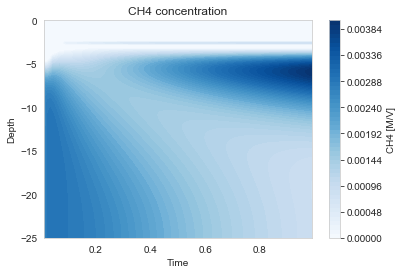

# Column Transport Guide

The `Column` class solves the 1D advection-diffusion-reaction equation in porous media, combining spatial transport with chemical reactions.

## Creating a Column

```python
from porousmedialab.column import Column

column = Column(length=25, dx=0.2, tend=1, dt=0.001, w=0.2)
```

**Parameters:**
- `length` (float): Domain length (e.g., sediment depth in cm)
- `dx` (float): Grid spacing (mesh size)
- `tend` (float): End time of simulation
- `dt` (float): Timestep
- `w` (float): Default advection velocity (burial rate)
- `ode_method` (str): ODE solver method - `'scipy'` (default, fastest), `'scipy_sequential'`, or `'rk4'`

## Adding Species

```python
column.add_species(
    theta=0.9,              # Porosity or 1-porosity
    name='O2',              # Species name
    D=368,                  # Diffusion coefficient
    init_conc=0,            # Initial concentration (scalar or array)
    bc_top_value=0.231,     # Top boundary value
    bc_top_type='dirichlet',# Top boundary type
    bc_bot_value=0,         # Bottom boundary value
    bc_bot_type='flux',     # Bottom boundary type
    w=None,                 # Species-specific advection (optional)
    int_transport=True      # Integrate transport? (True for dissolved)
)
```

**Parameters:**
- `theta` (float or array): Porosity for dissolved species, (1-porosity) for solids
- `name` (str): Species identifier
- `D` (float): Effective diffusion coefficient
- `init_conc` (float or array): Initial concentration profile
- `bc_top_value`, `bc_bot_value`: Boundary values
- `bc_top_type`, `bc_bot_type`: `'dirichlet'`/`'constant'` or `'neumann'`/`'flux'`
- `w` (float): Species-specific advection velocity (uses column default if not set)
- `int_transport` (bool): `True` for species with transport, `False` for immobile species

## Boundary Conditions

### Dirichlet (Constant Concentration)
```python
bc_top_type='dirichlet',
bc_top_value=1.0,  # Concentration fixed at 1.0
```
Use when the boundary concentration is known and constant (e.g., bottom water).

### Neumann (Flux)
```python
bc_top_type='flux',
bc_top_value=100,  # Flux of 100 units/area/time
```
Use for:
- Zero flux: `bc_value=0` (no exchange across boundary)
- Known deposition flux (e.g., organic matter settling)

## Dissolved vs. Solid Species

**Dissolved species** (use porosity θ):
```python
phi = 0.9  # Porosity
column.add_species(theta=phi, name='O2', D=368, ...)
```

**Solid species** (use 1-porosity):
```python
column.add_species(theta=1-phi, name='ite=OM', D=20, ...)
```

Solids typically have:
- Lower diffusion (bioturbation/mixing): D ≈ 10-50 cm²/yr
- Flux boundary at top (deposition)
- Flux boundary at bottom (zero flux)

## Defining Reactions

Same as batch - use `constants`, `rates`, and `dcdt`:

```python
column.constants['k'] = 0.5
column.rates['R1'] = 'k * OM * O2'
column.dcdt['OM'] = '-R1'
column.dcdt['O2'] = '-R1'
```

## Running the Simulation

```python
column.solve(verbose=True)
```

## Accessing Results

```python
# Concentration array: shape (N, num_timesteps)
# N = number of spatial points
conc = column.O2.concentration

# Depth array
x = column.x

# Time array
time = column.time

# Get profile at specific time index
profile_at_t10 = column.O2.concentration[:, 10]

# Get time series at specific depth index
timeseries_at_d5 = column.O2.concentration[5, :]
```

## Plotting Methods

```python
# Final concentration profiles for all species
column.plot_profiles()

# Single species profile
column.plot_profile('O2')

# Contour plot (depth vs time)
column.contour_plot('O2')

# Contour plots for all species
column.plot_contourplots()

# Time series at specific depths
column.plot_depths('O2', [1, 5, 10])  # Depths in cm

# Profiles at specific times
column.plot_times('O2', [0.1, 0.5, 1.0])  # Times
```

## Flux Estimation

Estimate diffusive + advective flux at boundaries:

```python
# Flux at top boundary over time
flux_top = column.estimate_flux_at_top('O2')

# Flux at bottom boundary
flux_bot = column.estimate_flux_at_bottom('O2')

# With specific time indices
flux_top_subset = column.estimate_flux_at_top('O2', idx=slice(0, 100))

# Higher order accuracy (default is 4)
flux_top = column.estimate_flux_at_top('O2', order=2)
```

## Saving and Loading Profiles

Save final profiles for restart:
```python
column.save_final_profiles()
# Creates CSV files: O2.csv, OM.csv, etc.
```

Load profiles as initial conditions:
```python
column.load_initial_conditions()
# Loads from CSV files in current directory
```

## Changing Boundary Conditions

Change boundaries during simulation (inside a custom loop):

```python
column.change_boundary_conditions(
    element='O2',
    i=timestep_index,
    bc_top_value=0.1,
    bc_top_type='dirichlet',
    bc_bot_value=0,
    bc_bot_type='flux'
)
```

## Complete Example

```python
from porousmedialab.column import Column

# Create sediment column
w = 0.2       # Burial rate (cm/yr)
L = 25        # Depth (cm)
dx = 0.2      # Grid spacing (cm)
t = 1         # Simulation time (years)
dt = 1e-3     # Timestep (years)
phi = 0.9     # Porosity

sediment = Column(L, dx, t, dt, w)

# Add dissolved oxygen
sediment.add_species(
    theta=phi,
    name='O2',
    D=368,                    # Molecular diffusion
    init_conc=0,
    bc_top_value=0.231,       # Saturation concentration
    bc_top_type='dirichlet',
    bc_bot_value=0,
    bc_bot_type='flux'
)

# Add organic matter (solid)
sediment.add_species(
    theta=1-phi,
    name='OM',
    D=20,                     # Bioturbation
    init_conc=10,
    bc_top_value=100,         # Deposition flux
    bc_top_type='flux',
    bc_bot_value=0,
    bc_bot_type='flux'
)

# Add CO2 product
sediment.add_species(
    theta=phi,
    name='CO2',
    D=368,
    init_conc=0,
    bc_top_value=0,
    bc_top_type='dirichlet',
    bc_bot_value=0,
    bc_bot_type='flux'
)

# Define reaction
sediment.constants['k'] = 1.0
sediment.constants['Km'] = 0.02

sediment.rates['R_ox'] = 'k * OM * O2 / (Km + O2)'

sediment.dcdt['O2'] = '-R_ox'
sediment.dcdt['OM'] = '-R_ox'
sediment.dcdt['CO2'] = 'R_ox'

# Run simulation
sediment.solve()

# Visualize
sediment.plot_profiles()
sediment.contour_plot('O2')
```



## Tips

1. **Stability**: Ensure `dt` is small enough relative to `dx` (CFL condition)
2. **Grid resolution**: Finer `dx` near boundaries where gradients are steepest
3. **Solver selection**: Use `ode_method='scipy'` (default) for best performance
4. **Units**: Common choices:
   - Length: cm
   - Time: years or days
   - Concentration: mol/L or µmol/cm³
   - Diffusion: cm²/time_unit
5. **Debugging**: Check `column.x` to verify grid setup
