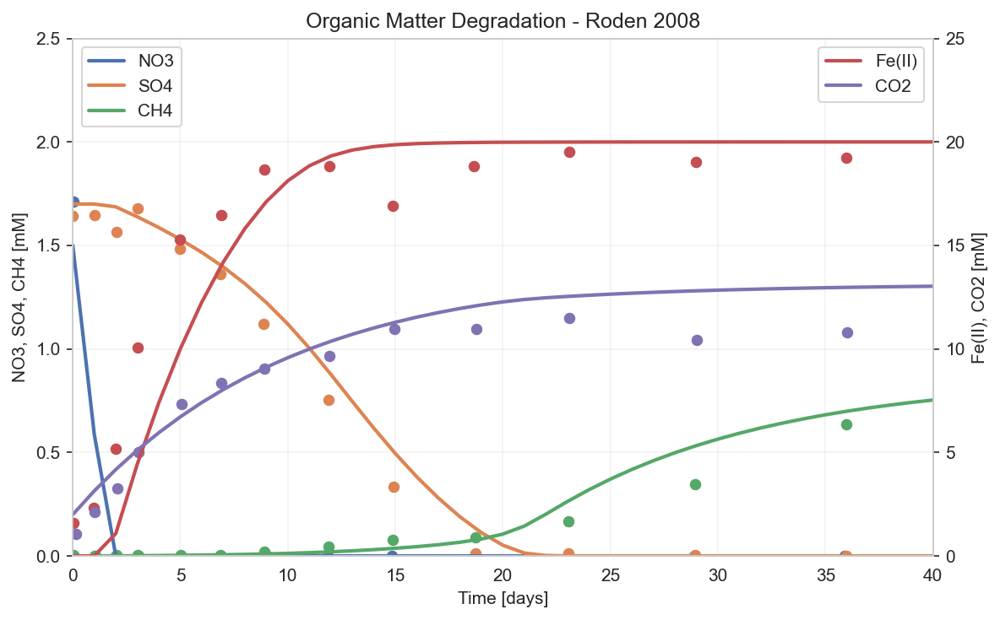

# Tutorial: Organic Matter Degradation (Roden 2008)

This tutorial recreates the organic matter degradation experiment from Roden et al. (2008), demonstrating how to model sequential terminal electron acceptor processes.

## Overview

In anoxic sediments, organic matter is degraded through a sequence of electron acceptors in order of decreasing energy yield:

1. **Nitrate reduction** (NO₃⁻ → N₂)
2. **Iron reduction** (Fe(III) → Fe(II))
3. **Sulfate reduction** (SO₄²⁻ → H₂S)
4. **Methanogenesis** (CO₂ → CH₄)

Each pathway is inhibited when a more favorable electron acceptor is available.

## Step 1: Create the Batch Reactor

```python
from porousmedialab.batch import Batch

# 40-day experiment with 1-day timestep
batch = Batch(tend=40, dt=1)
```

## Step 2: Add Chemical Species

```python
# Organic matter (electron donor)
batch.add_species(name='POC', init_conc=12e-3)  # mol/L

# Electron acceptors
batch.add_species(name='NO3', init_conc=1.5e-3)  # Nitrate
batch.add_species(name='Fe3', init_conc=20e-3)   # Fe(III)
batch.add_species(name='SO4', init_conc=1.7e-3)  # Sulfate

# Products
batch.add_species(name='CO2', init_conc=2e-3)    # Carbon dioxide
batch.add_species(name='Fe2', init_conc=0)       # Fe(II)
batch.add_species(name='CH4', init_conc=0)       # Methane
```

## Step 3: Define Kinetic Constants

We use Michaelis-Menten kinetics with inhibition terms:

```python
# Base degradation rate
batch.constants['k1'] = 0.1  # 1/day

# Half-saturation constants (inhibition thresholds)
batch.constants['Km_NO3'] = 0.001e-3   # Very low - NO3 inhibits others strongly
batch.constants['Km_Fe3'] = 2e-3       # Moderate
batch.constants['Km_SO4'] = 0.3e-4     # Low
```

## Step 4: Define Rate Expressions

Each pathway is inhibited by all more favorable acceptors:

```python
# Nitrate reduction - no inhibition
batch.rates['r_NO3'] = 'k1 * POC * NO3 / (Km_NO3 + NO3)'

# Iron reduction - inhibited by nitrate
batch.rates['r_Fe3'] = 'k1 * POC * Fe3 / (Km_Fe3 + Fe3) * Km_NO3 / (Km_NO3 + NO3)'

# Sulfate reduction - inhibited by nitrate and iron
batch.rates['r_SO4'] = 'k1 * POC * SO4 / (Km_SO4 + SO4) * Km_Fe3 / (Km_Fe3 + Fe3) * Km_NO3 / (Km_NO3 + NO3)'

# Methanogenesis - inhibited by all others
batch.rates['r_CH4'] = 'k1 * POC * Km_SO4 / (Km_SO4 + SO4) * Km_Fe3 / (Km_Fe3 + Fe3) * Km_NO3 / (Km_NO3 + NO3)'
```

**Note the inhibition pattern:** Each rate includes `Km / (Km + Acceptor)` terms for all more favorable acceptors. When the acceptor concentration is high, this term → 0, inhibiting the reaction.

## Step 5: Set Mass Balance Equations (dcdt)

Apply stoichiometric coefficients:

```python
# Organic matter consumption (sum of all pathways)
batch.dcdt['POC'] = '- r_NO3 - r_Fe3 - r_SO4 - r_CH4'

# Electron acceptors (stoichiometry from reaction equations)
batch.dcdt['NO3'] = '- 4/5 * r_NO3'      # 5 CH2O + 4 NO3 → ...
batch.dcdt['Fe3'] = '- 4 * r_Fe3'         # CH2O + 4 Fe(III) → ...
batch.dcdt['SO4'] = '- 1/2 * r_SO4'       # 2 CH2O + SO4 → ...

# Products
batch.dcdt['Fe2'] = '4 * r_Fe3'
batch.dcdt['CO2'] = 'r_NO3 + r_Fe3 + r_SO4 + 0.5 * r_CH4'
batch.dcdt['CH4'] = '1/2 * r_CH4'
```

## Step 6: Run the Simulation

```python
batch.solve()
```

## Step 7: Visualize Results

```python
import matplotlib.pyplot as plt

fig, ax1 = plt.subplots(figsize=(8, 5))
ax2 = ax1.twinx()

# Left axis: NO3, SO4, CH4
ax1.plot(batch.time, 1e3 * batch.NO3.concentration[0], label='NO₃')
ax1.plot(batch.time, 1e3 * batch.SO4.concentration[0], label='SO₄')
ax1.plot(batch.time, 1e3 * batch.CH4.concentration[0], label='CH₄')
ax1.set_ylabel('NO₃, SO₄, CH₄ [mM]')
ax1.set_ylim(0, 2.5)

# Right axis: Fe(II), CO2
ax2.plot(batch.time, 1e3 * batch.Fe2.concentration[0], 'C3', label='Fe(II)')
ax2.plot(batch.time, 1e3 * batch.CO2.concentration[0], 'C4', label='CO₂')
ax2.set_ylabel('Fe(II), CO₂ [mM]')
ax2.set_ylim(0, 25)

ax1.set_xlabel('Time [days]')
ax1.legend(loc='upper left')
ax2.legend(loc='upper right')
plt.show()
```

## Results



The simulation shows the characteristic sequential pattern:

1. **Days 0-2**: NO₃ is rapidly consumed (blue line drops to zero)
2. **Days 2-15**: Fe(III) reduction dominates, Fe(II) accumulates (orange)
3. **Days 10-25**: SO₄ reduction begins as Fe(III) depletes (orange drops)
4. **Days 20+**: Methanogenesis starts as SO₄ depletes (green rises)

CO₂ (purple) accumulates throughout as the product of all degradation pathways.

## Key Takeaways

1. **Inhibition terms** create the sequential pattern - each pathway waits for more favorable acceptors to deplete
2. **Michaelis-Menten kinetics** provide smooth transitions between pathways
3. **Stoichiometric coefficients** ensure mass balance

## Complete Code

```python
from porousmedialab.batch import Batch
import matplotlib.pyplot as plt

# Create batch
batch = Batch(tend=40, dt=1)

# Species
batch.add_species(name='POC', init_conc=12e-3)
batch.add_species(name='CO2', init_conc=2e-3)
batch.add_species(name='Fe2', init_conc=0)
batch.add_species(name='CH4', init_conc=0)
batch.add_species(name='NO3', init_conc=1.5e-3)
batch.add_species(name='Fe3', init_conc=20e-3)
batch.add_species(name='SO4', init_conc=1.7e-3)

# Constants
batch.constants['Km_NO3'] = 0.001e-3
batch.constants['Km_Fe3'] = 2e-3
batch.constants['Km_SO4'] = 0.3e-4
batch.constants['k1'] = 0.1

# Rates
batch.rates['r_NO3'] = 'k1 * POC * NO3 / (Km_NO3 + NO3)'
batch.rates['r_Fe3'] = 'k1 * POC * Fe3 / (Km_Fe3 + Fe3) * Km_NO3 / (Km_NO3 + NO3)'
batch.rates['r_SO4'] = 'k1 * POC * SO4 / (Km_SO4 + SO4) * Km_Fe3 / (Km_Fe3 + Fe3) * Km_NO3 / (Km_NO3 + NO3)'
batch.rates['r_CH4'] = 'k1 * POC * Km_SO4 / (Km_SO4 + SO4) * Km_Fe3 / (Km_Fe3 + Fe3) * Km_NO3 / (Km_NO3 + NO3)'

# Mass balance
batch.dcdt['POC'] = '- r_NO3 - r_Fe3 - r_SO4 - r_CH4'
batch.dcdt['NO3'] = '- 4/5 * r_NO3'
batch.dcdt['Fe3'] = '- 4 * r_Fe3'
batch.dcdt['Fe2'] = '4 * r_Fe3'
batch.dcdt['SO4'] = '- 1/2 * r_SO4'
batch.dcdt['CO2'] = 'r_NO3 + r_Fe3 + r_SO4 + 0.5 * r_CH4'
batch.dcdt['CH4'] = '1/2 * r_CH4'

# Solve and plot
batch.solve()
batch.plot_profiles()
```

## Reference

Roden, E. E., & Jin, Q. (2011). Thermodynamics of microbial growth coupled to metabolism of glucose, ethanol, short-chain organic acids, and hydrogen. Applied and environmental microbiology, 77(5), 1907-1909.
