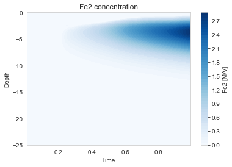

# Tutorial: Sediment Diagenesis Model

This tutorial builds a comprehensive early diagenesis model simulating the biogeochemical processes in marine sediments, including organic matter degradation, redox reactions, and mineral precipitation/dissolution.

## Overview

Marine sediment diagenesis involves:
- **Primary reactions**: Organic matter degradation via multiple electron acceptors
- **Secondary reactions**: Reoxidation of reduced species, mineral precipitation
- **Transport**: Molecular diffusion, advection (burial), bioturbation

## Step 1: Set Up the Column

```python
from porousmedialab.column import Column
import numpy as np

# Domain parameters
w = 0.2      # Burial rate (cm/yr)
L = 25       # Sediment depth (cm)
dx = 0.2     # Grid spacing (cm)
t = 1        # Simulation time (years)
dt = 1e-3    # Timestep (years)
phi = 0.9    # Porosity

sediment = Column(L, dx, t, dt, w)
```

## Step 2: Add Dissolved Species

Dissolved species use porosity (θ = φ) and have molecular diffusion:

```python
# Oxygen - constant at sediment-water interface
sediment.add_species(
    theta=phi, name='O2', D=368,
    init_conc=0,
    bc_top_value=0.231, bc_top_type='dirichlet',
    bc_bot_value=0, bc_bot_type='flux'
)

# Nitrate
sediment.add_species(
    theta=phi, name='NO3', D=359,
    init_conc=0,
    bc_top_value=1.5e-3, bc_top_type='dirichlet',
    bc_bot_value=0, bc_bot_type='flux'
)

# Dissolved metals and anions
sediment.add_species(theta=phi, name='Mn2', D=220, init_conc=2e-3,
    bc_top_value=2e-3, bc_top_type='dirichlet', bc_bot_value=0, bc_bot_type='flux')

sediment.add_species(theta=phi, name='Fe2', D=127, init_conc=0,
    bc_top_value=0, bc_top_type='dirichlet', bc_bot_value=0, bc_bot_type='flux')

sediment.add_species(theta=phi, name='SO4', D=189, init_conc=15,
    bc_top_value=28, bc_top_type='dirichlet', bc_bot_value=0, bc_bot_type='flux')

sediment.add_species(theta=phi, name='NH4', D=363, init_conc=22e-3,
    bc_top_value=22e-3, bc_top_type='dirichlet', bc_bot_value=0, bc_bot_type='flux')

sediment.add_species(theta=phi, name='CH4', D=220, init_conc=0,
    bc_top_value=0, bc_top_type='dirichlet', bc_bot_value=0, bc_bot_type='flux')

sediment.add_species(theta=phi, name='TIC', D=220, init_conc=0,
    bc_top_value=0, bc_top_type='dirichlet', bc_bot_value=0, bc_bot_type='flux')

sediment.add_species(theta=phi, name='TRS', D=284, init_conc=0,
    bc_top_value=0, bc_top_type='dirichlet', bc_bot_value=0, bc_bot_type='flux')
```

## Step 3: Add Solid Species

Solid species use (1-φ) and have lower "diffusion" (bioturbation mixing):

```python
# Organic matter - two pools with different reactivity
sediment.add_species(
    theta=1-phi, name='OM1', D=20, init_conc=15,
    bc_top_value=180, bc_top_type='flux',  # Deposition flux
    bc_bot_value=0, bc_bot_type='flux'
)

sediment.add_species(
    theta=1-phi, name='OM2', D=20, init_conc=5,
    bc_top_value=40, bc_top_type='flux',
    bc_bot_value=0, bc_bot_type='flux'
)

# Metal oxides
sediment.add_species(theta=1-phi, name='MnO2', D=20, init_conc=0,
    bc_top_value=40, bc_top_type='flux', bc_bot_value=0, bc_bot_type='flux')

sediment.add_species(theta=1-phi, name='FeOH3', D=20, init_conc=0,
    bc_top_value=75, bc_top_type='flux', bc_bot_value=0, bc_bot_type='flux')

# Authigenic minerals
sediment.add_species(theta=1-phi, name='MnCO3', D=20, init_conc=0,
    bc_top_value=0, bc_top_type='flux', bc_bot_value=0, bc_bot_type='flux')

sediment.add_species(theta=1-phi, name='FeCO3', D=20, init_conc=0,
    bc_top_value=0, bc_top_type='flux', bc_bot_value=0, bc_bot_type='flux')

sediment.add_species(theta=1-phi, name='FeS', D=20, init_conc=0,
    bc_top_value=0, bc_top_type='flux', bc_bot_value=0, bc_bot_type='flux')
```

## Step 4: Define Constants

```python
# OM degradation rates
sediment.constants['k_OM1'] = 1      # Fast pool (1/yr)
sediment.constants['k_OM2'] = 0.1    # Slow pool (1/yr)

# Porosity factor
sediment.constants['F'] = 0.6

# Half-saturation constants
sediment.constants['Km_O2'] = 20e-3
sediment.constants['Km_NO3'] = 5e-3
sediment.constants['Km_SO4'] = 1.6
sediment.constants['Km_MnO2'] = 16
sediment.constants['Km_FeOH3'] = 100

# Secondary reaction rate constants
sediment.constants['k7'] = 5e+3    # Mn oxidation
sediment.constants['k8'] = 1.4e+2  # Fe(II) oxidation
# ... (additional constants)

# Equilibrium constants for mineral precipitation
sediment.constants['K_MnCO3'] = 10**(-8.5 + 6)
sediment.constants['K_FeCO3'] = 10**(-8.4 + 6)
sediment.constants['K_FeS'] = 10**(-2.2 + 3)
```

## Step 5: Define Primary Degradation Rates

Sequential inhibition pattern for each electron acceptor:

```python
# Aerobic respiration (fast OM)
sediment.rates['R1a'] = 'k_OM1 * OM1 * O2 / (Km_O2 + O2)'
sediment.rates['R1b'] = 'k_OM2 * OM2 * O2 / (Km_O2 + O2)'

# Denitrification
sediment.rates['R2a'] = 'k_OM1 * OM1 * NO3 / (Km_NO3 + NO3) * Km_O2 / (Km_O2 + O2)'
sediment.rates['R2b'] = 'k_OM2 * OM2 * NO3 / (Km_NO3 + NO3) * Km_O2 / (Km_O2 + O2)'

# Mn reduction
sediment.rates['R3a'] = 'k_OM1 * OM1 * MnO2 / (Km_MnO2 + MnO2) * Km_NO3 / (Km_NO3 + NO3) * Km_O2 / (Km_O2 + O2)'
sediment.rates['R3b'] = 'k_OM2 * OM2 * MnO2 / (Km_MnO2 + MnO2) * Km_NO3 / (Km_NO3 + NO3) * Km_O2 / (Km_O2 + O2)'

# Fe reduction
sediment.rates['R4a'] = 'k_OM1 * OM1 * FeOH3 / (Km_FeOH3 + FeOH3) * Km_MnO2 / (Km_MnO2 + MnO2) * Km_NO3 / (Km_NO3 + NO3) * Km_O2 / (Km_O2 + O2)'
sediment.rates['R4b'] = 'k_OM2 * OM2 * FeOH3 / (Km_FeOH3 + FeOH3) * Km_MnO2 / (Km_MnO2 + MnO2) * Km_NO3 / (Km_NO3 + NO3) * Km_O2 / (Km_O2 + O2)'

# Sulfate reduction
sediment.rates['R5a'] = 'k_OM1 * OM1 * SO4 / (Km_SO4 + SO4) * Km_FeOH3 / (Km_FeOH3 + FeOH3) * Km_MnO2 / (Km_MnO2 + MnO2) * Km_NO3 / (Km_NO3 + NO3) * Km_O2 / (Km_O2 + O2)'
sediment.rates['R5b'] = 'k_OM2 * OM2 * SO4 / (Km_SO4 + SO4) * Km_FeOH3 / (Km_FeOH3 + FeOH3) * Km_MnO2 / (Km_MnO2 + MnO2) * Km_NO3 / (Km_NO3 + NO3) * Km_O2 / (Km_O2 + O2)'

# Methanogenesis
sediment.rates['R6a'] = 'k_OM1 * OM1 * Km_SO4 / (Km_SO4 + SO4) * Km_FeOH3 / (Km_FeOH3 + FeOH3) * Km_MnO2 / (Km_MnO2 + MnO2) * Km_NO3 / (Km_NO3 + NO3) * Km_O2 / (Km_O2 + O2)'
sediment.rates['R6b'] = 'k_OM2 * OM2 * Km_SO4 / (Km_SO4 + SO4) * Km_FeOH3 / (Km_FeOH3 + FeOH3) * Km_MnO2 / (Km_MnO2 + MnO2) * Km_NO3 / (Km_NO3 + NO3) * Km_O2 / (Km_O2 + O2)'
```

## Step 6: Define Secondary Reactions

```python
# Reoxidation reactions
sediment.rates['R8'] = 'k8 * O2 * Fe2'      # Fe(II) oxidation
sediment.rates['R12'] = 'k12 * TRS * O2'    # Sulfide oxidation
sediment.rates['R16'] = 'k16 * CH4 * O2'    # Methane oxidation
sediment.rates['R17'] = 'k17 * CH4 * SO4'   # Anaerobic CH4 oxidation

# Mineral precipitation/dissolution
sediment.rates['R21'] = 'k21 * (Mn2 * TIC / K_MnCO3 - 1)'     # MnCO3 precip
sediment.rates['R22'] = 'k22 * (Fe2 * TIC / K_FeCO3 - 1)'     # FeCO3 precip
sediment.rates['R23'] = 'k23 * (Fe2 * TRS / H / K_FeS - 1)'   # FeS precip
```

## Step 7: Set Mass Balance Equations

```python
# Dissolved species (scaled by porosity factor F)
sediment.dcdt['O2'] = 'F * (-(x1 + 2*y1)/x1 * R1a - (x2 + 2*y2)/x2 * R1b) - (R8/4 + 2*R12 + 2*R16)'
sediment.dcdt['NO3'] = 'F * (y1/x1 * R1a + y2/x2 * R1b - (4*x1 + 3*y1)/5/x1 * R2a)'
sediment.dcdt['Mn2'] = 'F * (2*(R3a + R3b) - R21)'
sediment.dcdt['Fe2'] = 'F * (4*(R4a + R4b) - R22) - R8'
sediment.dcdt['SO4'] = 'F * (-(R5a + R5b)/2) + R12 - R17'
sediment.dcdt['CH4'] = 'F/2 * (R6a + R6b) - R16 - R17'
sediment.dcdt['TIC'] = 'F * (R1a + R2a + R3a + R4a + R5a + R6a/2 + R1b + ...) + R16 + R17'
sediment.dcdt['TRS'] = 'F * ((R5a + R5b)/2) - R12 - R17'

# Solid species
sediment.dcdt['OM1'] = '-(R1a + R2a + R3a + R4a + R5a + R6a)'
sediment.dcdt['OM2'] = '-(R1b + R2b + R3b + R4b + R5b + R6b)'
sediment.dcdt['MnO2'] = '-2*(R3a + R3b)'
sediment.dcdt['FeOH3'] = '-4*(R4a + R4b) + R8/F'
sediment.dcdt['MnCO3'] = 'R21'
sediment.dcdt['FeCO3'] = 'R22'
sediment.dcdt['FeS'] = 'R23'
```

## Step 8: Run and Visualize

```python
sediment.solve()

# Plot concentration profiles
sediment.plot_profiles()

# Contour plots showing depth vs time
sediment.plot_contourplots()

# Reconstruct and plot rates
sediment.reconstruct_rates()
sediment.plot_contourplots_of_rates()
```

## Results


The profiles show characteristic zonation:
- **Oxic zone** (0-1 cm): O₂ present, aerobic respiration
- **Suboxic zone** (1-5 cm): NO₃, Mn, Fe reduction
- **Anoxic zone** (5-25 cm): SO₄ reduction and methanogenesis



## Key Features of This Model

1. **Two OM pools**: Fast (OM1) and slow (OM2) degradation
2. **Sequential electron acceptors**: Each inhibited by more favorable ones
3. **Secondary reactions**: Reoxidation maintains redox balance
4. **Mineral precipitation**: Fe and Mn carbonates, iron sulfide
5. **Coupled dissolved-solid**: Porosity factor accounts for phase differences

## Tips for Diagenesis Models

1. **Start simple**: Add complexity gradually
2. **Check mass balance**: Sum of sources should equal sinks
3. **Verify zonation**: O₂ penetration depth, sulfate-methane transition
4. **Sensitivity analysis**: Test key parameters (k_OM, Km values)
5. **Steady state**: Run long enough to reach equilibrium profiles
